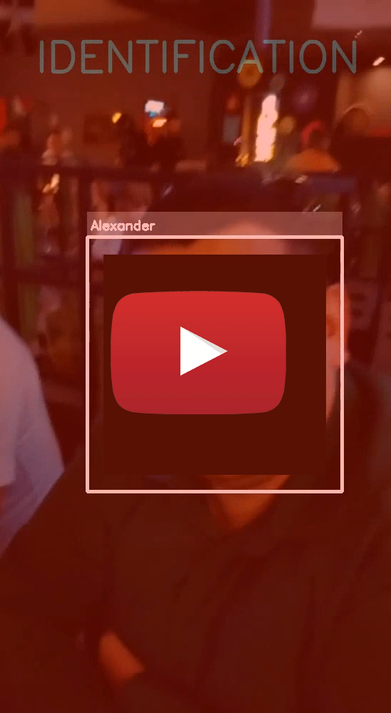

## [ENG] Face detection and recognition program (in the style of T800 vision)

A personal project exploring the potential of computer vision using OpenCV.

### 🛠 Tech Stack:
* **Language:** Python
* **Libraries:** OpenCV (`cv2`, `cv2.face`), `numpy`, `ast`
* **Algorithms:** Haar Cascades (detection) + LBPH (training and recognition)

---

### 📖 User Manual / How it Works:

The program has an intuitive console interface. It can detect human faces in videos using Haar Cascades. The configuration file specifies the parameters used, including recognition accuracy, file names, etc.
1) Without a trained model, the program simply detects faces in videos.
2) To teach the program to recognize people, it is necessary to train the model using photographs. To do this, create a folder named "photos_****" in the program folder, where **** is the person's name (in English), and add photos of the person to it (the more the better). If you are training the model from scratch, you can create multiple folders for each person. Then, select "Train from Scratch" in the program menu. The program will automatically scan these folders, read the photos, and classify them. The faces in the photos will be captured, decolorized, and placed in the "dataset" folder. After this, a file with the "trainer.yml" data model will be created. There's also a webcam training mode, but it hasn't been tested much.
3) If we have a ready-made model with data and need to add a new person, we create a folder with photos using the same principle and specify the name of this folder in the "Additional training" menu.
4) The program allows you to view the processed video without saving it or save it to disk. After training the model and selecting the appropriate menu option for viewing/saving, we specify the name of the *.mp4 file for processing (without extension) and view the result.

---

## [RU] Программа для детекции и распознавания лиц (в стиле зрения Т800)

Персональный проект по исследованию возможностей компьютерного зрения на базе OpenCV.

### 🛠 Технологический стек:
* **Язык:** Python
* **Библиотеки:** OpenCV (`cv2`, `cv2.face`), `numpy`, `ast`
* **Алгоритмы:** Каскады Хаара (детекция) + LBPH (обучение и распознавание)

---

### 📖 Инструкция пользователя / Как это работает:

Программа имеет интуитивно понятный консольный интерфейс. Может определять лица людей на видео, обращаясь к "Каскадам Хаара". В файле с конфигурацией указаны используемые параметры: параметры точности распознавания, имена файлов и т.д. 
1) Не имея обученной модели, программа просто определяет лица людей на видео.
2) Чтобы программа научилась распознавать людей, необходимо обучить модель на основе фотографий. Для этого создаём в папке с программой папку с именем "photos_****", где **** - это имя человека (на английском) и помещаем туда фото человека (чем больше - тем лучше). Если мы обучаем модель с нуля - можно создать несколько папок под каждого человека. Затем в меню программы выбираем пункт "Обучить с нуля". Программа сама увидит эти папки, считает фото и классифицирует их. Лица с фото захватятся, обесцветятся и поместятся в папку "dataset". После этого будет создан файл с моделью данных "trainer.yml". Также есть режим обучения через веб-камеру, но он почти не тестировался.  
3) Если у нас есть готовая модель с данными, и в неё надо добавить нового человека - по тому же принципу создаём папку с фото, и в меню, в пункте "Дообучение", указываем имя этой папки.  
4) Программа позволяет посмотреть обработанное видео без сохранения, либо сохранить его на диск. Обучив модель, и выбрав соответствующий пункт меню для просмотра/сохранения, указываем имя файла *.mp4 для обработки (без расширения) и смотрим результат.  

---
  

    
      

  

